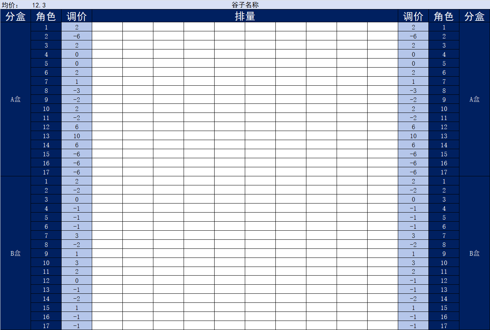
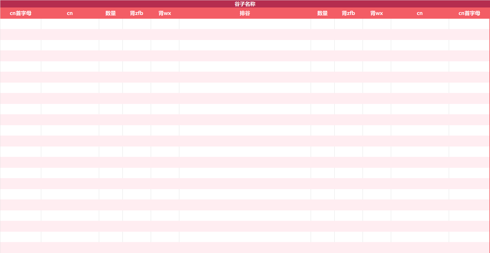

# GoodsPaySheetAuto——谷团自动打肾表工具

[](https://github.com/bryarrow/GoodsPaySheetAuto/releases/latest)

## 介绍

管理（工具人）福音，自动根据排表打肾表的小工具，什么？！新谷有几百妈咪要吃？打肾表眼要花了？来试试这个吧！

拼团吃过谷的妈咪都知道，谷圈拼团的**排表**，
一般以商品名称作为第一列，调价和配比数（不保配的镭射票、拍立得等配比数不同）写在后面，接着是排表的cn列表，方便统计和更新余量。

就像这样： 

| 商品名称 | 调价 |  cn   | cn | 调价 | 商品名称 |
|:----:|:--:|:-----:|:--:|:--:|:----:|
| 角色A  | -1 | 妈咪1cn | …… | -1 | 角色A  |
|  ……  | …… |  ……   | …… | …… |  ……  |



根据这样的排表，会再制作**肾表**，方便对照收肾（收钱）。

肾表一般会长这样：

| cn首字母 |  cn  | 数量 | 肾zfb | 肾wx | 排谷 | 数量 | 肾zfb | 肾wx |  cn  | cn首字母 |
|:-----:|:----:|:--:|:----:|:---:|:--:|:--:|:----:|:---:|:----:|:-----:|
|   A   | A妈咪1 | 1  |  1   | 1.1 | …… | 1  |  1   | 1.1 | A妈咪1 |   A   |
|  ……   |  ……  | …… |  ……  | ……  | …… | …… |  ……  | ……  |  ……  |  ……   |



不过肾表的制作因为角色数量多，排表妈咪多且杂乱等原因，一直是谷圈团咪头痛的问题，耗时耗力还要保证准确率，为了解决这样的问题，本工具应运而生。
解决了这个问题

## 下载使用

点此从GitHub Release下载：
[](https://github.com/bryarrow/GoodsPaySheetAuto/releases/latest)

初次使用建议下载带EXCEL模板的ZIP格式，解压后填好排表，启动程序按提示输入各项信息后肾表就制作好啦

## 更新日志

- V0.1
  - 基本功能已经做好了，但没有写任何交互，请无意贡献的使用者忽略这个版本

## TODO

参见本仓库的Projects：  
https://github.com/users/bryarrow/projects/2

## 自行编译打包：

本项目编写时使用Python版本：3.10，最低支持Python3.9；不支持Python2

使用第三方库：pypinyin；xlwings

支持的操作系统：Windows10及以上；MacOS理论支持但未经过测试；Linux不支持

使用该软件需安装Microsoft EXCEL或WPS表格

### 环境配置

安装python并执行：

```bash
pip install pypinyin xlwings pyinstaller
```

### 编译打包

Windows:
```bash
pyinstaller main.py
```

## 贡献代码

参见：[CONTRIBUTE]()

`目前还没有写qwq，如果有希望贡献的可以直接fork，修改后提起PR，记得使用pylint检查代码~`

## 致谢与版权信息：

本项目采用 **木兰V2** 许可证开源。[[LICENSE]](https://github.com/bryarrow/GoodsPaySheetAuto/blob/master/LICENSE)

本项目离不开其他的开源项目的支持，他们是：

- pypinyin：将汉字字符串转换为拼音的实用工具。[[LICENSE]](https://github.com/mozillazg/python-pinyin/blob/master/LICENSE.txt)
- xlwings：读取xlsx表格的实用库。[[LICENSE]](https://github.com/xlwings/xlwings/blob/main/LICENSE.txt)

感谢所有软件作者的辛勤付出。

## 友情链接

- [crops：谷圈软件工具收录](https://github.com/bryarrow/crops)
- [GGTabulator：一个比本项目功能更丰富的肾表退补生成器（我也是写完才发现自己重复造了轮子qwq）](https://github.com/Banny-D/GGTabulator)

## 联系我们

开发者邮箱：berry.cn@outlook.com
